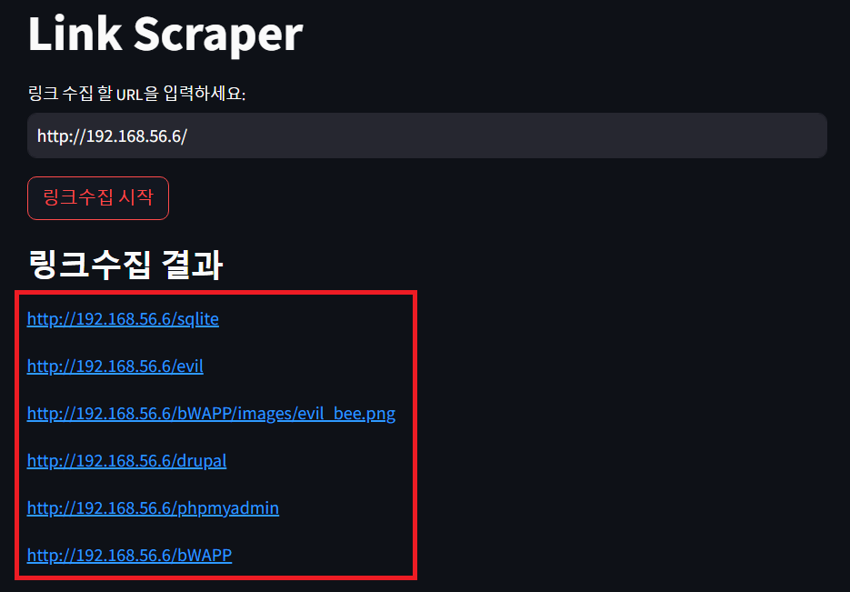

# 링크 수집기

- 타겟으로 지정한 URL 페이지의 `a` 태그의 `href` 속성 값, `img` 태그의 `src` 속성 값을 모두 수집합니다.

# Examples

**수행 환경:**

- 대상 URL: `http://192.168.56.6`(bee-box)

 
 

1. `streamlit run links_scraping.py` 실행

2. 링크를 수집할 대상 **URL** 지정

<!--  -->

3. 대상 URL 페이지의 링크 **수집 완료**

